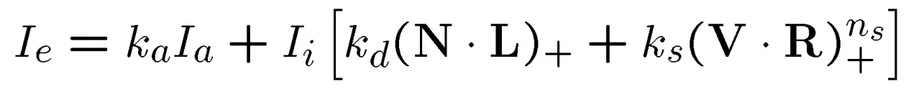
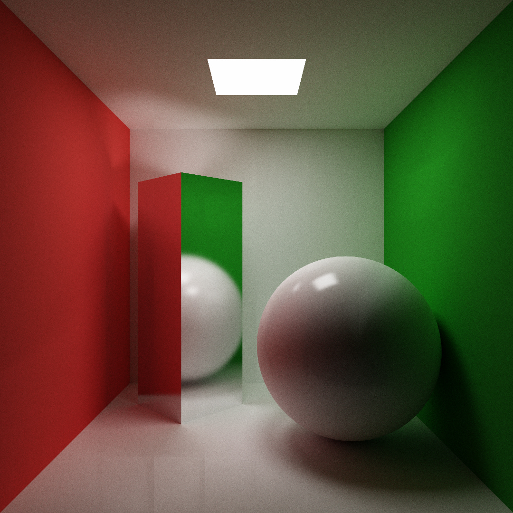
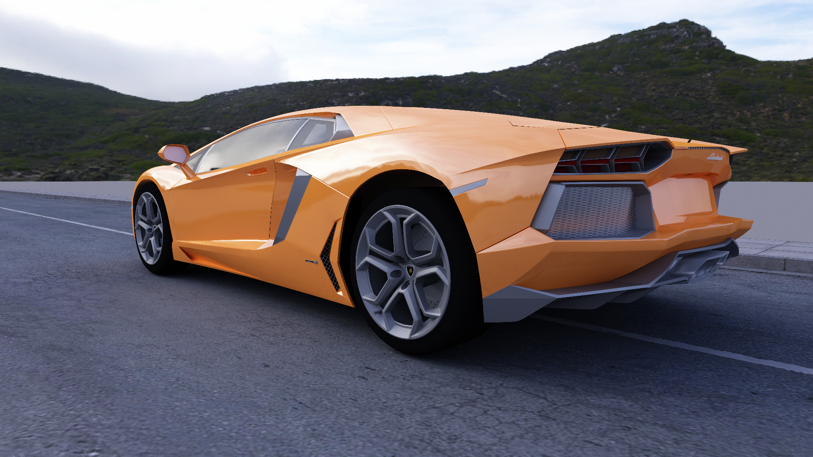
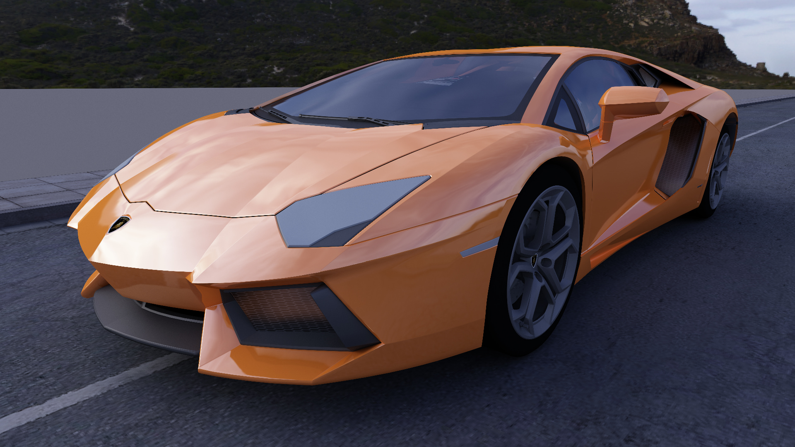
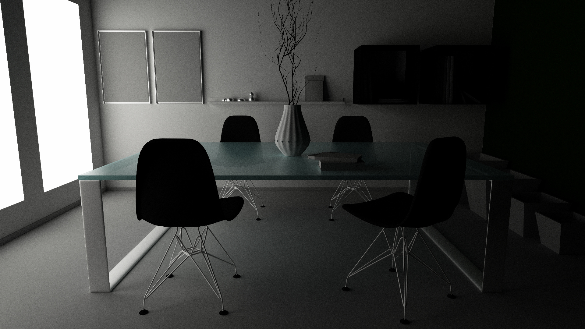
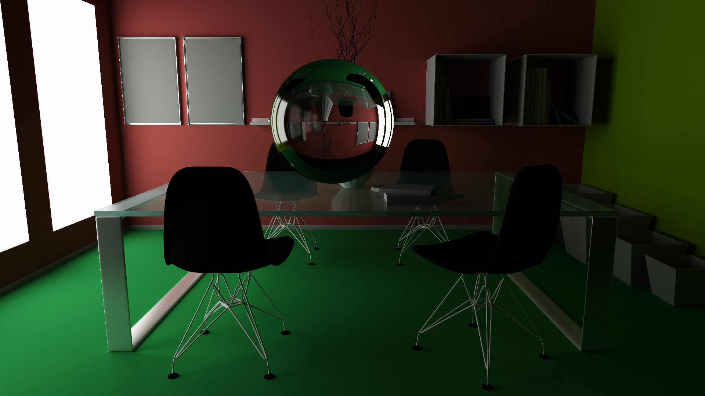
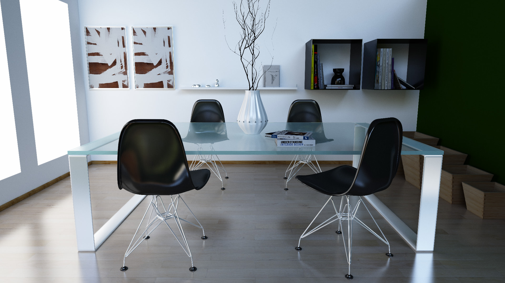
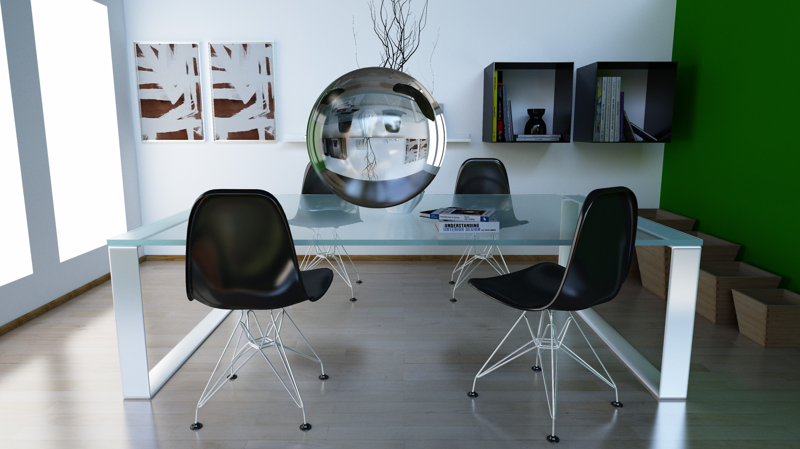

## 一、概述

Monte Carlo Path Tracing ，材质使用 Phong 模型。

## 二、使用方法

仅需引入头文件 `ray_tracing.h`。

```cpp
Model car("scenes/car/car.obj");      // 加载模型，支持 obj 和 mtl，贴图支持 bmp 和 hdr
Obj car1(car);                        // 从模型实例化一个物体，支持多物体
car1.set_pose(glm::mat4x4(1.0), 1.0); // 设置物体姿态（齐次变换矩阵）和缩放，支持运行中调整
Render renderer(1920, 1080);          // 初始化渲染器
renderer.add_obj(car1);               // 添加要渲染的物体
                                      // 设置相机，支持运行中调整
renderer.set_camera(glm::dvec3(8.22, -0.61, -9.8), 
                    glm::dvec3(7.514, -0.702, -9.097), 
                    glm::dvec3(-0.065, 0.996, 0.065), 45); 
int samples = renderer.render();      // 渲染并返回当前采样数。多次调用累计渲染同一帧。方便保存进度。
                                      // 结果保存为 bmp 图片
Bitmap results(1920, 1080, renderer.get_framebuffer()); 
results.SaveFile("results/" + to_string(samples) + ".bmp");
```

## 三、程序细节 

### 1. 文件读取 

- `.mtl` 文件使用正则表达式解析，格式要求宽松
- `.obj` 文件行数过多，直接用 `stringstream` 解析，不能有多余的空格。进行了一定的多线程加速（顶点，法向量，纹理坐标，面 4线程加速）
- `.bmp` 加载代码来自 [tinyrenderer](https://github.com/ssloy/tinyrenderer)  
- `.hdr` 加载代码作者 *Igor Kravtchenko*

### 2. 坐标变换与构建 BVH 树

- 与传统渲染器不同，光线追踪只需将片元变换到世界坐标系，这部分比较简单
- BVH 构建直接按数量对半分，也比较简单，只是很难保证构建出比较平衡的树

### 3. 光线求交 

1. 光线与 BVH 求交，得到一组包围盒 
2. 将包围盒按光线进入时间前后排序
3. 对于包围盒中的每一个片元，对光线进行求交
4. 如果已经命中一个片元，则之后进入的包围盒不再需要求交。

### 4. 递归采样 

- 如果光线路径碰撞次数大于一定值，返回黑色
- 如果光线没有碰撞片元，返回 skybox 对应颜色
- 如果光线碰到片元，按材质文件定义计算出的反射、漫反射、折射概率，选择方向，递归求解，再根据自发光和系数计算当前颜色并返回。

### 5. skybox 天空球

- 直接根据光线方向在球坐标系中的两个角度 $\theta \in [0,\pi]$ , $\phi \in [0, 2\pi]$ 当成纹理坐标采样，与位置无关
- 可绕 $z$ 轴旋转一定角度，视具体场景而定

### 6. BRDF 渲染方程的蒙特卡洛采样 



- 采样数为 1， 即直接返回采样得到的光强
- 直接将漫反射和高光反射的系数，作为对应方向上的概率分布进行采样，这样消掉了采样方程中的系数，只要将每个像素每条光线结果加起来求平均即可。相当于根据预期进行重要性采样。
- 漫反射只跟光照入射角度有关，入射角越大，则越暗。设 $u_1, u_2$ 为 0 到 1 的均匀分布，在法向量球坐标系中采样方向的 PDF 为 $\arccos(\sqrt{u_1}, 2\pi u_2)$
- 高光反射在反射光坐标系中的 PDF 为  $\arccos(u_1^{\frac{1}{n+1}}, 2\pi u_2)$
- 材质漫反射、折射、散射概率计算：材质文件中 Ks, Kd, 以及自定义的折射系数 Kr 的 RGB 的最大值。如果加起来大于 1， 则归一化。另外 Ks, Kd, Kr 还要除以对应的概率，从而保证采样正确。

### 7. hdr 转 ldr 

- 渲染器采样基于物理的光强定义，最后需要转换到 RGB 256。这里使用 $1-e^{- lum * a}$ 作为 Tone Mapping。其中 $lum$ 是可调的全局光强信息，$a$ 是输入光强。

### 8. 多线程均衡负载

- 由于场景固定，每个像素点的采样光线路径几乎也是固定的，如果直接在图片的长宽方向上进行并行加速，会造成某些线程提前结束而闲置的情况。因此这里将像素次序打乱，使得每个线程处理一组随机的像素，避免了浪费线程的情况。


## 四、场景展示 

- CPU：Ryzen 5 3600 6c12t@3.9Ghz

### 1. Cornell Box

- 深度：10；光线数：10000；分辨率：1080x1080；渲染时间：3h 左右
- 材质参数有所调整，主要是加强灯光，提高 Ns
- 相比于参照结果，地面上和墙上出现了某种投影
- 光源面积小，噪点多



### 2. Car

- 深度：8；光线数：20000；分辨率：1920x1080；渲染时间：15h 左右
- 材质有所调整 
- 场景简单，skybox 光源，1000 采样后图像几乎无变化



- 深度：9；光线数：15000；分辨率：1920x1080；渲染时间：10h 左右
- 材质有所调整，玻璃增加透射
- 1000 采样后图像几乎无变化
- 未在 skybox 中找到参考图片的背景，所以自己选了一个相近的角度。可能贴图路面未与背景路面重合，不过影响不大




### 3. Dining room

- 深度：10；光线数：7000；分辨率：1920x1080；渲染时间：4h 左右
- 材质有所调整，玻璃增加透射
- 未提供贴图，场景较暗



### 4. Dining room +


- 深度：10；光线数：17000；分辨率：1920x1080；渲染时间：20h 左右
- 增加一颗玻璃球，模拟凸透镜成像
- 场景光源大，采样效率高，效果比较好
- 5000 采样后只有轻微噪点



### 5. Dining room + texture

- 素材更新后补做，贴图 + skybox
- 深度：10；光线数：12000；分辨率：1920x1080；渲染时间：20h 左右



### 6. Dining room 4k

- 素材更新后补做
- 深度：10；光线数：3300；分辨率：3840x2160；渲染时间：20h 左右




